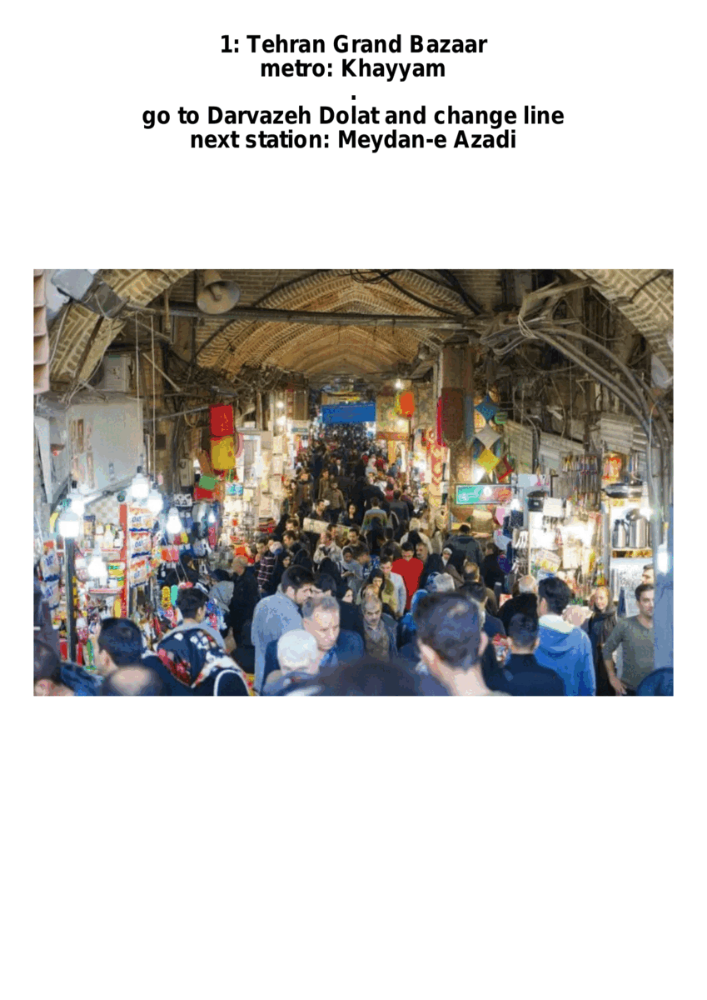

# Transit_Tehran_Tourism

## the goal of this project:
Tehran is a beautiful city with remarkable tourist attractions. She is home to numerous palaces and museums which offer a delightful gate to its ancient history of 7000 years and the history of mighty persian empires.However, Tehran also houses 16 million people alongside its borders. Being a giant city,she experiences giant city problems. Air pollution is so severe the city is shut down for months and even becomes literally uninhabitable for weeks.Couple that with unbearable traffic and you'll see why the municipality has invested so much into Tehrans sizeable transit network.

Tehrani people enjoy a relativelly nice transit system. Having 7 lines of heavy rail enables it to provide a considerable coverage and capacity. i highly encourage tourists to use transit for the following reasons:

1. It is super cheap.
1. You wont remember my city as a deadlock traffic infested place and you wont remember my culture as the deadliest driving seen on the planet.
1. you'll get to see my people as who they are, not how islamic republic depicts us
1. you'll help us have a cleaner air

thank you
this project was originally meant to be my final project for CS50 python

## What is it?

Transit_Tehran_Tourism is a travel guide that embraces the transit system. It chooses the tourist attractions based on your preferences and suggests the most straightforward way to visit them all. You can give your prefered document type(text,ascii,pdf,gif) and number of places you want to visit with the type of those tourist attractions as input and recieve a customized guide for wandering in Tehran!

## How to use it?

to start, first run the following commands

```bash
apt-get update
git clone https://github.com/parsoli83/Transit_Tehran_Tourism
cd Transit_Tehran_Tourism
pip install -r requirements.txt
```

if you run Transit_Tehran_tourism without any arguments it would show you the default guide:

```
$ ./Transit_Tehran_Tourism.py

1: Tehran Grand Bazaar
metro: Khayyam
go to Darvazeh Dolat and change line
next station: Meydan-e Azadi
2: Azadi Tower
metro: Meydan-e Azadi
go to Towhid and change line
next station: Milad Tower
3: Milad Tower
metro: Milad Tower
end of the trip!
```

you can specify the format in which you recieve the guide with `-g [text/ascii/pdf/gif]` and your prefered number of destinations with `-n number_of_destinations`:

```
$ ./Transit_Tehran_Tourism.py -g ascii -n 5
```
and the result would be
```
########################################
1: Tehran Grand Bazaar
metro: Khayyam
***
go to Darvazeh Dolat and change line
next station: Meydan-e Azadi
########################################
2: Azadi Tower
metro: Meydan-e Azadi
***
go to Towhid and change line
next station: Milad Tower
########################################
3: Milad Tower
metro: Milad Tower
***
go to Mohammadieh and change line
next station: Panzdah-e Khordad
########################################
4: Moslem Restaurant
metro: Panzdah-e Khordad
***
next attraction is in the same station!
```
or take a pdf as output with:
```
$ ./Transit_Tehran_Tourism.py -g ascii -n 5
```

this program supports up to 12 destinations!

```
$ ./Transit_Tehran_Tourism.py -g ascii -n 12
```
with the output being like this:
```
########################################
1: Tehran Grand Bazaar
metro: Khayyam
***
go to Darvazeh Dolat and change line
next station: Meydan-e Azadi
########################################
2: Azadi Tower
metro: Meydan-e Azadi
***
go to Towhid and change line
next station: Milad Tower
########################################
3: Milad Tower
metro: Milad Tower
***
go to Mohammadieh and change line
next station: Panzdah-e Khordad
########################################
4: Moslem Restaurant
metro: Panzdah-e Khordad
***
next attraction is in the same station!
########################################
5: Golestan Palace
metro: Panzdah-e Khordad
***
next attraction is on the same line!
next station: Imam Khomeini
########################################
6: Park e Shahr
metro: Imam Khomeini
***
next attraction is in the same station!
########################################
7: Museum of Ancient Iran
metro: Imam Khomeini
***
next attraction is in the same station!
########################################
8: Museum of the Islamic Era
metro: Imam Khomeini
***
next attraction is on the same line!
next station: Shahid Haghani
########################################
9: Holy Defense Museum
metro: Shahid Haghani
***
next attraction is on the same line!
next station: Tajrish
########################################
10: Imamzadeh Saleh
metro: Tajrish
***
next attraction is on the same line!
next station: Shahid Haghani
########################################
11: Park e Taleghani
metro: Shahid Haghani
***
end of the trip!

```

I hope you would enjoy your days in Tehran more using my code!.


